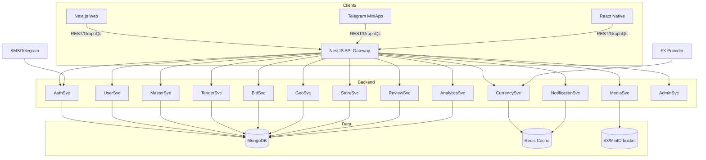
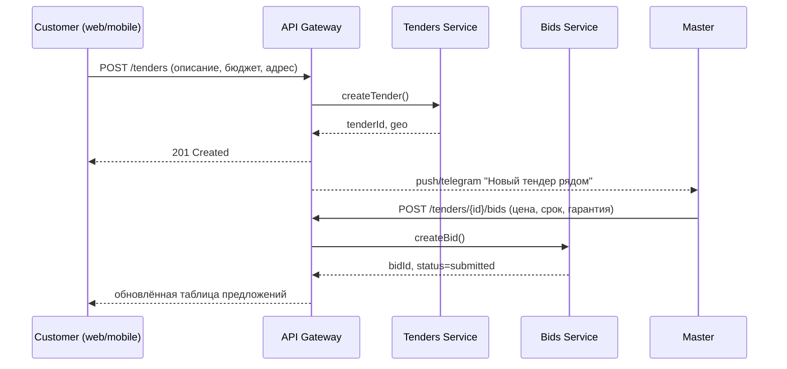
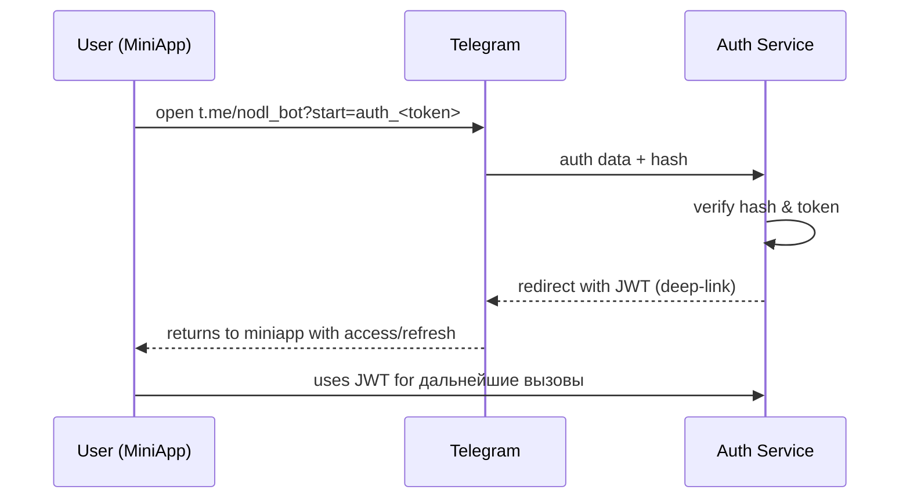
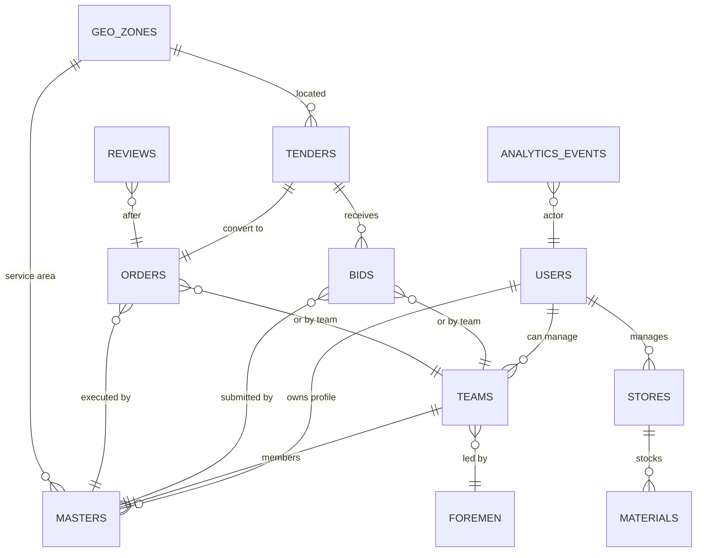

# Архитектура NODL

## Обзор

Платформа объединяет веб, Telegram MiniApp и мобильное приложение вокруг единого API (Node.js + NestJS) и MongoDB. Redis используется для кешей (сессии, курсы валют, антифрод). Nginx даёт единый вход и маршрутизацию по доменам/путям.

## Высокоуровневая диаграмма

## Модули backend

- **Auth Service** — OTP по телефону, Telegram OAuth, refresh-токены, сохранение языка/страны.
- **User Service** — профили, роли, KYC/верификация мастеров и бригад.
- **Masters & Teams Service** — карточки, специализации, портфолио, календарь занятости.
- **Tenders & Orders Service** — создание/фильтрация тендеров, трансформация в заказы.
- **Bids Service** — отклики с ценой/сроком/гарантией, статусная машина.
- **Stores & Materials Service** — витрины, склады, спецпредложения.
- **Geo Service** — геозоны, поиск в радиусе, обратное геокодирование.
- **Ratings & Reviews Service** — оценки с причинами, антифрод.
- **Analytics & Heatmap** — события, конверсия, тепловые карты спроса/предложения.
- **Currency Service** — курсы, кеширование, конвертация из базовой валюты (EUR) в локальную (BYN/RUB/PLN).
- **Media Service** — загрузка, сжатие, CDN/S3-совместимое хранилище.
- **Notifications** — Telegram/push/email очереди.
- **Admin** — модерация, просмотр аналитики и антифрода.

## Роли и доступы

- **Customer** — создаёт тендеры, выбирает исполнителей, оставляет отзывы.
- **Master** — индивидуальный исполнитель, портфолио, отклики, график.
- **Team** — бригада с несколькими мастерами, управляется прорабом.
- **Foreman** — управляет несколькими бригадами, получает аналитику по ним.
- **Store** — управляет товарами/складами, публикует промо.
- **Admin** — модерация и операционная поддержка.

## Мультиязычность

- Заголовок `Accept-Language` (fallback: `DEFAULT_LOCALE` из `.env`).
- Словари RU/EN/PL хранятся в `packages/i18n` и кешируются на клиентах.
- Язык сохраняется в профиле пользователя и подставляется в уведомления.

## Мультивалютность

- Базовая валюта: EUR.
- Цены сущностей (тендер, ставка, заказ) хранят `amount_eur` и `amount_local + currency`.
- Currency Service тянет курсы (`CURRENCY_API_URL`), кладёт в Redis, конвертирует для ответов API.

## Гео и выдача "как Яндекс Go"

- Geo Service хранит геозоны (страна/регион/город/район) и радиусные запросы.
- API отдаёт ленты "заказы рядом" для мастеров и "мастера рядом" для заказчиков с фильтрами по специализациям.

## Sequence: создание тендера и отклики

## Sequence: авторизация через Telegram

## ERD (Mongo, концептуально)

## Коллекции MongoDB (концепт)

- `users`: роли, контакты, страна, язык, KYC-статусы.
- `masters`: профиль, навыки, портфолио, ставки, график.
- `teams`: состав, руководитель (foreman), расписание.
- `stores`: магазины, склады, геозоны.
- `materials`: товары, цены в EUR и локальной валюте, привязка к складам.
- `tenders`: требования, бюджет, сроки, адрес/гео.
- `bids`: предложения с ценой, сроком, гарантией, статусами.
- `orders`: подтверждённые работы, финальные суммы, гарантия.
- `reviews`: рейтинги, причины низких оценок, антифрод-флаги.
- `geo_zones`: страна/город/район, координаты и полигоны.
- `analytics_events`: просмотры, отклики, клики, отказ.
- `media_files`: ссылки на хранилище, оптимизации.

## CI/CD и инфраструктура

- `infra/docker` — базовые Dockerfile/скрипты.
- `infra/nginx/nginx.conf` — reverse proxy и маршрутизация клиентов.
- `infra/ci-cd` — место для GitHub Actions/ArgoCD/Helm charts.
